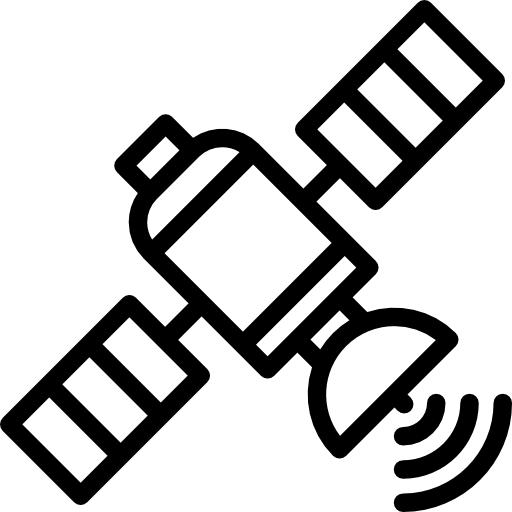

<div align="center">



# Телеметрия МКА

**Наземная станция приёма телеметрии малого космического аппарата (CubeSat)**

Приложение на Qt 6, которое принимает кадры телеметрии по UDP, проверяет их
целостность, следит за границами нормы и показывает состояние подсистем.
В комплекте имитатор борта на Python.


</div>

---

> **Место для скриншота.** Запусти приложение с имитатором, нажми <kbd>Alt</kbd>+<kbd>PrtScn</kbd>,
> сохрани как `docs/screenshot.png` и вставь сюда ``.
> Одна картинка в README стоит десяти абзацев.

## О проекте

Телеметрия **не генерируется внутри приложения**. Данные приходят снаружи
отдельными пакетами — так же, как они приходили бы с настоящего спутника через
наземный демодулятор. Приложение о том, как они получены, ничего не знает: его
дело — принять байты, проверить, разобрать и показать.

```
имитатор борта                       наземная станция (это приложение)
┌──────────────┐                     ┌────────────────────────────────────┐
│ sat_sim.py   │                     │  UdpTelemetryLink                  │
│              │   UDP :5005         │   1. журнал сырых кадров           │
│ модель витка │ ──────────────────▶ │   2. разбор CCSDS + проверка CRC   │
│ упаковка     │   288 байт/кадр     │   3. учёт потерь по счётчику        │
│ CRC-16       │                     │                     │              │
└──────────────┘                     │                     ▼              │
                                     │  проверка границ нормы (29 парам.) │
                                     │                     │              │
                                     │                     ▼              │
                                     │  вкладки подсистем, графики,       │
                                     │  журнал пакетов, список нарушений   │
                                     └────────────────────────────────────┘
```

Что из этого сделано «как в реальности»:

| Решение | Почему так |
|---|---|
| Формат кадра в стиле **CCSDS Space Packet** | Стандарт, на котором работает профессиональная космическая связь |
| **CRC-16-CCITT** и отбраковка битых кадров | Радиоканал портит данные; показания по битому кадру не обновляются |
| Учёт потерь по **счётчику последовательности** | Единственный способ узнать, что кадр не дошёл |
| **Сырой журнал пишется до проверок** | Битый кадр тоже данные: по нему видно состояние канала, и его можно переразобрать |
| Поля сериализуются **по одному, big-endian** | Выравнивание структуры зависит от компилятора, порядок байт — от архитектуры |
| **Границы нормы заданы таблицей**, а не кодом | В SCOS-2000 и Yamcs пределы описываются данными; смена режима правит таблицу, не исходники |
| **Индикация устаревания** показаний | Значение пятиминутной давности не должно выглядеть как «сейчас» |
| **UDP** как транспорт | Именно UDP стоит между модемом и обработкой в реальных наземных комплексах |

## Быстрый старт

### Требования

- Qt 6.5 или новее с компонентами **Widgets, Charts, Network** (проверено на 6.11.1)
- Компилятор с C++17 (проверено на MinGW 13.1.0)
- CMake 3.16+
- Python 3.8+ для имитатора — только стандартная библиотека, ставить ничего не нужно

### Сборка

В Qt Creator: открыть `CMakeLists.txt`, выбрать комплект Qt 6 и собрать.

Из командной строки — укажи, где лежит Qt, иначе CMake его не найдёт:

```bash
cmake -S . -B build -DCMAKE_BUILD_TYPE=Release -DCMAKE_PREFIX_PATH=/путь/к/Qt/6.11.1/mingw_64 && cmake --build build
```

На Windows путь обычно `C:/Qt/6.11.1/mingw_64`, на Linux — `~/Qt/6.11.1/gcc_64`.
Если Qt установлен из репозитория дистрибутива, `CMAKE_PREFIX_PATH` не нужен.

### Запуск

Нужны два окна. В первом — приложение: нажать **«Подключиться»** (порт 5005),
затем **«Показать данные»**.

Во втором — имитатор борта:

```bash
cd sim && python sat_sim.py
```

Через секунду в журнале появится `AOS — связь установлена`, и показания начнут
обновляться. Если остановить имитатор, через 5 секунд статус сменится на
`НЕТ СВЯЗИ`, показания погаснут и в журнале появится `LOS`.

## Что можно посмотреть

### Аварийные ситуации

Сценарии задают, что именно передавать — можно разыграть ситуацию, которую
иначе пришлось бы ждать месяцами.

```bash
cd sim && python sat_sim.py --scenario scenarios/low_battery.jsonl
```

| Сценарий | Что происходит |
|---|---|
| `low_battery.jsonl` | Разряд батареи: норма → предупреждение на 27 % → авария на 12 % → просадка напряжения шин → восстановление |
| `panel_overheat.jsonl` | Перегрев панели: 91 °C → 104 °C → тепло идёт внутрь корпуса, греется CPU → авария в двух подсистемах сразу |
| `adcs_tumbling.jsonl` | Закрутка аппарата: 2.8 °/с → 7.4 °/с → маховики на гашении → сбой вычислителя ориентации |

Свой сценарий — файл JSONL, одна строка на кадр, поля подставляются поверх
сгенерированных:

```json
{"_note": "перегрев пятой панели", "thermal.temp_solar[4]": 104.0, "_repeat": 8}
```

`_repeat` держит состояние N кадров, `_note` печатается в консоль. Индекс в
квадратных скобках адресует элемент массива.

### Плохой канал

```bash
cd sim && python sat_sim.py --rate 5 --drop 0.15 --corrupt 0.15
```

Часть кадров не отправляется, часть уходит с перевёрнутым битом. В приложении
видно, как растут счётчики «потеряно» и «CRC-ошибок», а битые кадры попадают в
журнал со статусом `CRC ERR`, не портя показания.

### Переигровка записанного пролёта

Приложение пишет всё принятое в `logs/telemetry_ГГГГММДД_ччммсс.bin` рядом с
исполняемым файлом. Записанный пролёт можно проиграть заново — кадры уходят как
есть, со своими CRC и счётчиками, поэтому картина воспроизводится байт в байт:

```bash
cd sim && python sat_sim.py --replay ../build/logs/telemetry_20260927_120000.bin
```

## Протокол

Кадр — 288 байт, big-endian:

```
 0      2      4      6                                  286    288
 +------+------+------+-----------------------------------+------+
 | APID | счёт | длина|          payload (280)            | CRC  |
 +------+------+------+-----------------------------------+------+
 |     Primary Header (6)      |           Data Field (282)      |
```

Полная байтовая раскладка со смещениями каждого поля, формат журнала сырых
кадров и таблица проверок канала — в **[PROTOCOL.md](PROTOCOL.md)**.

Раскладка задана в двух местах и должна совпадать: `writePayload()` /
`readPayload()` в [protocol.h](protocol.h) и `PAYLOAD_FORMAT` в
[sim/sat_sim.py](sim/sat_sim.py). Сверка:

```bash
cd sim && python sat_sim.py --selftest
```

## Границы нормы

Пределы для 29 параметров заданы одной таблицей в
[limitcheck.cpp](limitcheck.cpp). Четыре порога дают два коридора:

```
 critLow      warnLow                 warnHigh      critHigh
─────┼───────────┼──────── норма ─────────┼───────────┼─────
 АВАРИЯ   ПРЕДУПРЕЖДЕНИЕ            ПРЕДУПРЕЖДЕНИЕ  АВАРИЯ
```

```cpp
//                        имя                    ед.    критНиз предНиз предВыс критВыс
{"eps.soc_percent",   {"Заряд батареи (SOC)",    "%",    15.0,   30.0,  kNoHigh, kNoHigh}},
{"thermal.temp_cpu",  {"Температура CPU",       "°C",   -35.0,  -20.0,   60.0,    80.0 }},
```

При нарушении краснеет или желтеет значение, заголовок вкладки с проблемной
подсистемой и строка в списке нарушений. Устаревание важнее границ: если данные
перестали приходить, показания гаснут и авария снимается — про старое значение
нельзя утверждать, что параметр вне нормы *сейчас*.

Кроме полей пакета проверяются производные параметры: самая горячая из 12
панелей, максимальная угловая скорость по трём осям, обороты маховиков и норма
кватерниона. Последнее — проверка качества самих данных: норма обязана быть
единицей, отклонение означает сбой вычислителя ориентации.

Пороги подобраны под типовой 1U/3U CubeSat с литий-ионной сборкой 2S и орбитой
около 400 км. Для другого аппарата правится только таблица.

## Тесты

```bash
ctest --test-dir build --output-on-failure
```

126 проверок, только QtCore — окна не нужны. Покрыто: круговой прогон кадра по
всем полям, переполнение 14-битного счётчика, отбраковка чужого APID и неверной
версии, обрезанный и пустой кадр, все граничные значения таблицы, производные
параметры. Отдельно — перебор **всех 2240 одиночных битовых ошибок** в payload:
каждая обязана быть поймана CRC.

Тест также ловит рассинхрон: если в таблице границ появится параметр, которого
нет в разборе пакета, его предел никогда не сработает.

## Структура

```
├── telemetry.h          структуры телеметрии по подсистемам
├── protocol.h           формат кадра, CRC, сборка и разбор
├── udplink.h/.cpp       приём по UDP, проверки, учёт потерь
├── rawlog.h/.cpp        журнал сырых кадров
├── limitcheck.h/.cpp    таблица границ нормы и её проверка
├── mainwindow.h/.cpp    интерфейс: вкладки подсистем, графики, журналы
├── main.cpp
├── tests/
│   └── test_main.cpp    тесты протокола и границ
├── sim/
│   ├── sat_sim.py       имитатор борта
│   └── scenarios/       сценарии аварийных ситуаций
├── PROTOCOL.md          байтовая раскладка кадра и формат журнала
└── CMakeLists.txt
```

Подсистемы в пакете: **EPS** (питание), **терморегулирование**, **ADCS**
(ориентация), **OBC** (бортовой компьютер), **COMM** (радиосвязь), **GPS**.

## Ключи имитатора

| Ключ | Назначение |
|---|---|
| `--host`, `--port` | Куда отправлять, по умолчанию `127.0.0.1:5005` |
| `--rate` | Кадров в секунду, по умолчанию 1 |
| `--count` | Сколько кадров отправить, 0 — без ограничения |
| `--scenario`, `--loop` | Файл сценария и повтор по кругу |
| `--replay`, `--speed` | Переиграть записанный журнал, с ускорением |
| `--drop`, `--corrupt` | Доля теряемых и искажаемых кадров, 0..1 |
| `--apid` | Чужой APID — проверить, что приёмник отвергает не свои пакеты |
| `--orbit-seconds` | Длительность витка, по умолчанию 600 с (реальная ≈ 5400) |
| `--seed` | Зерно ГСЧ для повторяемости |
| `--selftest` | Проверить раскладку кадра и выйти |

## Что можно доделать

- **Архив и история.** Сейчас в памяти только последний пакет и 30 точек на графике температур. Записанный журнал приложением не читается — отмотать назад нельзя.
- **Разделение пакета по APID.** Одни 280 байт раз в секунду нереалистичны: в жизни EPS передаётся раз в секунду, ADCS раз в десять, GPS раз в полминуты.
- **Сырые отсчёты АЦП вместо `float`.** В настоящем канале 12-битное значение занимает 12 бит, а пересчёт в вольты и градусы — калибровка на земле. Наши 12 значений `solar_power` заняли бы 18 байт вместо 48.
- **Описание пакета данными, а не кодом** — формат XTCE, как в Yamcs и SCOS-2000: смещение, кодировка, полином и границы каждого параметра задаются в XML.
- **Команды на борт.** Наземная станция — это половина телеметрия, половина командование. Здесь есть только приём.
- **Локализация.** Механизм `QTranslator` подключён, но строки зашиты в коде и `.ts` пустой — нужен либо `tr()`, либо убрать машинерию.

